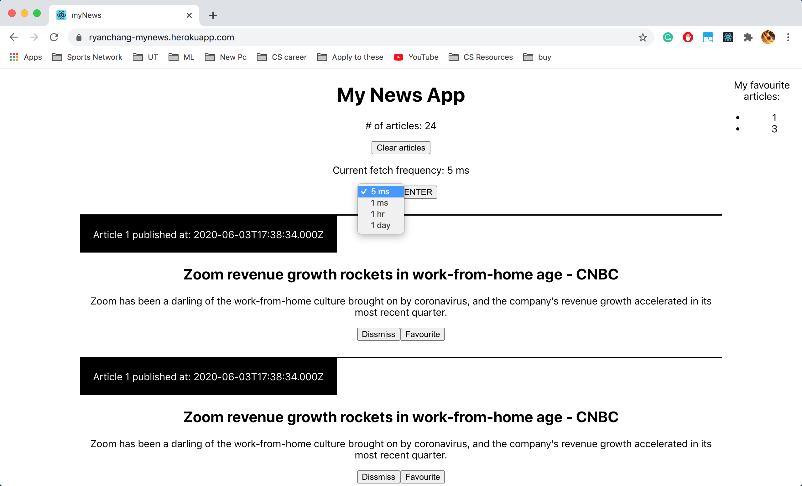
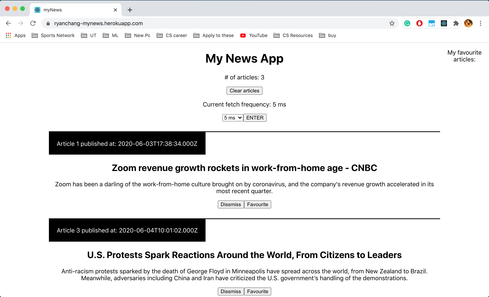

# [myNews](https://ryanchang-mynews.herokuapp.com/)

myNews is a web app made using Express in Node.js to pull data at a inputed refresh rate from a [mock API](http://www.mocky.io/v2/5ed92b8d31000090b6c4ebd1) and serve it to a React based front end.

<div align="center">
    
    
</div>

### Features

- Adjustable refresh reate (5 ms, 1 ms, 1 Day, 1 Hour)
- Favourite, dissmiss or clear news articles

## Getting Started

These instructions will get you a copy of the proejct up and running on your local machine for development and testing purposes.

### Prerequisites

Clone proj

```
git clone https://github.com/tyranitar898/myNews.git
```

cd into project directory and install dependencies

```
npm install
```

Run locally (runs test script)

```
npm run test
```

Now you can visit it at http://localhost:4000/

## Built With

- [Express](https://expressjs.com/) - Web framework for Node.js, to power its web server.
- [React](https://reactjs.org/) - for frontend.

## Authors

- **Ryan Chang** - _Developer_ - [Personal Website](https://tyranitar898.github.io/UofT/)
